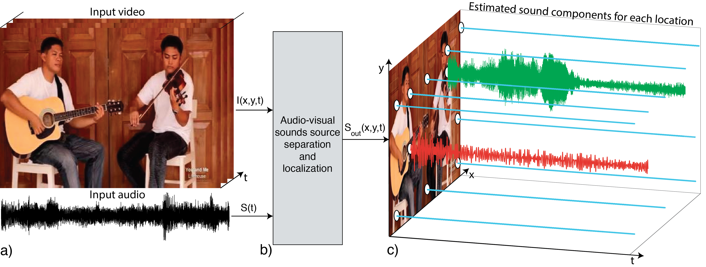

# Sound-of-Pixels
Codebase for ECCV18 "The Sound of Pixels".

*This repository is under construction.



## Environment
The code is developed under the following configurations.
- Hardware: 1-4 GPUs (change ```[--num_gpus NUM_GPUS]``` accordingly)
- Software: Ubuntu 16.04.3 LTS, ***CUDA>=8.0, Python>=3.5, PyTorch>=0.4.0***

## Training
1. Prepare video dataset.

    a. Download MUSIC dataset from: https://github.com/roudimit/MUSIC_dataset
    
    b. Download videos.

2. Preprocess videos. 

    a. Extract frames from videos.
  
    b. Extract waveforms from videos.

    c. Make training/validation index files.

3. Train the default model.
```bash
./scripts/train_MUSIC.sh
```

5. During training, visualizations are saved in HTML format under ```ckpt/MODEL_ID/visualization/```.

## Evaluation
1. Evaluate the trained model performance.
```bash
./scripts/eval_MUSIC.sh
```
